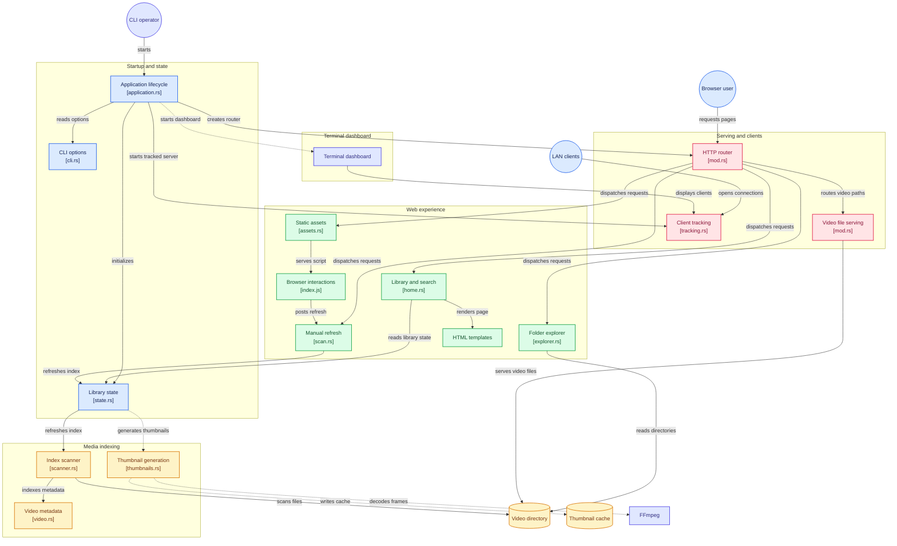

## Software Architechure

```mermaid
flowchart TD

subgraph group_startup["Startup and state"]
  node_application["Application lifecycle<br/>[application.rs]"]
  node_cli["CLI options<br/>[cli.rs]"]
  node_appstate["Library state<br/>[state.rs]"]
end

subgraph group_media["Media indexing"]
  node_scanner["Index scanner<br/>[scanner.rs]"]
  node_videomodel["Video metadata<br/>[video.rs]"]
  node_thumbnails["Thumbnail generation<br/>[thumbnails.rs]"]
end

subgraph group_web["Web experience"]
  node_home["Library and search<br/>[home.rs]"]
  node_refresh["Manual refresh<br/>[scan.rs]"]
  node_explorer["Folder explorer<br/>[explorer.rs]"]
  node_assets["Static assets<br/>[assets.rs]"]
  node_templates["HTML templates"]
  node_frontend["Browser interactions<br/>[index.js]"]
end

subgraph group_network["Serving and clients"]
  node_router["HTTP router<br/>[mod.rs]"]
  node_videostream["Video file serving<br/>[mod.rs]"]
  node_clienttracking["Client tracking<br/>[tracking.rs]"]
end

subgraph group_dashboard["Terminal dashboard"]
  node_tui["Terminal dashboard"]
end

node_operator(("CLI operator"))
node_mediafiles[("Video directory")]
node_thumbnailcache[("Thumbnail cache")]
node_ffmpeg["FFmpeg"]
node_browser(("Browser user"))
node_networkclients(("LAN clients"))

node_operator -->|"starts"| node_application
node_application -->|"reads options"| node_cli
node_application -->|"initializes"| node_appstate
node_appstate -->|"refreshes index"| node_scanner
node_scanner -->|"scans files"| node_mediafiles
node_scanner -->|"indexes metadata"| node_videomodel
node_appstate -.->|"generates thumbnails"| node_thumbnails
node_thumbnails -.->|"decodes frames"| node_ffmpeg
node_thumbnails -.->|"writes cache"| node_thumbnailcache
node_application -->|"creates router"| node_router
node_router -->|"dispatches requests"| node_home
node_router -->|"dispatches requests"| node_refresh
node_router -->|"dispatches requests"| node_explorer
node_router -->|"dispatches requests"| node_assets
node_router -->|"routes video paths"| node_videostream
node_home -->|"reads library state"| node_appstate
node_home -->|"renders page"| node_templates
node_refresh -->|"refreshes index"| node_appstate
node_explorer -->|"reads directories"| node_mediafiles
node_assets -->|"serves script"| node_frontend
node_browser -->|"requests pages"| node_router
node_frontend -->|"posts refresh"| node_refresh
node_videostream -->|"serves video files"| node_mediafiles
node_networkclients -->|"opens connections"| node_clienttracking
node_application -->|"starts tracked server"| node_clienttracking
node_application -.->|"starts dashboard"| node_tui
node_tui -->|"displays clients"| node_clienttracking

click node_application "https://github.com/bless-04/droptube-cli/blob/master/src/application.rs"
click node_cli "https://github.com/bless-04/droptube-cli/blob/master/src/models/cli.rs"
click node_appstate "https://github.com/bless-04/droptube-cli/blob/master/src/models/state.rs"
click node_scanner "https://github.com/bless-04/droptube-cli/blob/master/src/utils/scanner.rs"
click node_videomodel "https://github.com/bless-04/droptube-cli/blob/master/src/models/video.rs"
click node_thumbnails "https://github.com/bless-04/droptube-cli/blob/master/src/utils/thumbnails.rs"
click node_router "https://github.com/bless-04/droptube-cli/blob/master/src/server/mod.rs"
click node_home "https://github.com/bless-04/droptube-cli/blob/master/src/server/handlers/home.rs"
click node_refresh "https://github.com/bless-04/droptube-cli/blob/master/src/server/handlers/scan.rs"
click node_explorer "https://github.com/bless-04/droptube-cli/blob/master/src/server/handlers/explorer.rs"
click node_assets "https://github.com/bless-04/droptube-cli/blob/master/src/server/handlers/assets.rs"
click node_templates "https://github.com/bless-04/droptube-cli/tree/master/templates"
click node_frontend "https://github.com/bless-04/droptube-cli/blob/master/public/index.js"
click node_videostream "https://github.com/bless-04/droptube-cli/blob/master/src/server/mod.rs"
click node_clienttracking "https://github.com/bless-04/droptube-cli/blob/master/src/server/tracking.rs"
click node_tui "https://github.com/bless-04/droptube-cli/tree/master/src/tui"

classDef toneNeutral fill:#f8fafc,stroke:#334155,stroke-width:1.5px,color:#0f172a
classDef toneBlue fill:#dbeafe,stroke:#2563eb,stroke-width:1.5px,color:#172554
classDef toneAmber fill:#fef3c7,stroke:#d97706,stroke-width:1.5px,color:#78350f
classDef toneMint fill:#dcfce7,stroke:#16a34a,stroke-width:1.5px,color:#14532d
classDef toneRose fill:#ffe4e6,stroke:#e11d48,stroke-width:1.5px,color:#881337
classDef toneIndigo fill:#e0e7ff,stroke:#4f46e5,stroke-width:1.5px,color:#312e81
classDef toneTeal fill:#ccfbf1,stroke:#0f766e,stroke-width:1.5px,color:#134e4a
class node_application,node_cli,node_appstate,node_browser,node_networkclients toneBlue
class node_scanner,node_videomodel,node_thumbnails,node_mediafiles,node_thumbnailcache toneAmber
class node_home,node_refresh,node_explorer,node_assets,node_templates,node_frontend toneMint
class node_router,node_videostream,node_clienttracking toneRose
class node_tui,node_operator,node_ffmpeg toneIndigo
```
