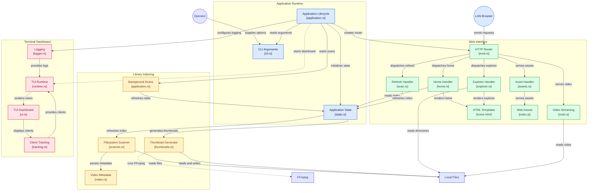

## Software Architechure

```mermaid
flowchart TD

subgraph group_runtime["Application Runtime"]
  node_cli_args["CLI Arguments<br/>[cli.rs]"]
  node_application["Application Lifecycle<br/>[application.rs]"]
  node_app_state["Application State<br/>[state.rs]"]
end

subgraph group_indexing["Library Indexing"]
  node_scanner["Filesystem Scanner<br/>[scanner.rs]"]
  node_video_metadata["Video Metadata<br/>[video.rs]"]
  node_thumbnail_generator["Thumbnail Generator<br/>[thumbnails.rs]"]
  node_background_scans["Background Scans<br/>[application.rs]"]
end

subgraph group_web["Web Interface"]
  node_router["HTTP Router<br/>[mod.rs]"]
  node_home_handler["Home Handler<br/>[home.rs]"]
  node_explorer_handler["Explorer Handler<br/>[explorer.rs]"]
  node_refresh_handler["Refresh Handler<br/>[scan.rs]"]
  node_streaming["Video Streaming<br/>[mod.rs]"]
  node_assets_handler["Asset Handler<br/>[assets.rs]"]
  node_templates["HTML Templates<br/>[home.html]"]
  node_web_assets["Web Assets<br/>[index.js]"]
end

subgraph group_dashboard["Terminal Dashboard"]
  node_tracking["Client Tracking<br/>[tracking.rs]"]
  node_tui_runtime["TUI Runtime<br/>[runtime.rs]"]
  node_tui_ui["TUI Dashboard<br/>[ui.rs]"]
  node_logging["Logging<br/>[logger.rs]"]
end

node_operator(("Operator"))
node_browser(("LAN Browser"))
node_ffmpeg["FFmpeg"]
node_local_files["Local Files"]

node_operator -->|"supplies options"| node_cli_args
node_application -->|"reads arguments"| node_cli_args
node_application -->|"initializes state"| node_app_state
node_app_state -->|"refreshes index"| node_scanner
node_scanner -->|"reads files"| node_local_files
node_scanner -->|"parses metadata"| node_video_metadata
node_app_state -->|"generates thumbnails"| node_thumbnail_generator
node_thumbnail_generator -.->|"runs FFmpeg"| node_ffmpeg
node_thumbnail_generator -->|"reads and writes"| node_local_files
node_application -->|"creates router"| node_router
node_application -->|"starts scans"| node_background_scans
node_background_scans -->|"refreshes state"| node_app_state
node_browser -->|"sends requests"| node_router
node_router -->|"dispatches home"| node_home_handler
node_router -->|"dispatches explorer"| node_explorer_handler
node_router -->|"dispatches refresh"| node_refresh_handler
node_router -->|"serves video"| node_streaming
node_router -->|"serves assets"| node_assets_handler
node_home_handler -->|"reads index"| node_app_state
node_home_handler -->|"renders home"| node_templates
node_explorer_handler -->|"reads directories"| node_local_files
node_explorer_handler -->|"renders explorer"| node_templates
node_refresh_handler -->|"refreshes index"| node_app_state
node_streaming -->|"reads video"| node_local_files
node_assets_handler -->|"serves assets"| node_web_assets
node_application -->|"configures logging"| node_logging
node_application -.->|"starts dashboard"| node_tui_runtime
node_tracking -->|"provides clients"| node_tui_runtime
node_logging -->|"provides logs"| node_tui_runtime
node_tui_runtime -->|"renders views"| node_tui_ui
node_tui_ui -->|"displays clients"| node_tracking

click node_cli_args "https://github.com/bless-04/droptube-cli/blob/master/src/models/cli.rs"
click node_application "https://github.com/bless-04/droptube-cli/blob/master/src/application.rs"
click node_app_state "https://github.com/bless-04/droptube-cli/blob/master/src/models/state.rs"
click node_router "https://github.com/bless-04/droptube-cli/blob/master/src/server/mod.rs"
click node_scanner "https://github.com/bless-04/droptube-cli/blob/master/src/utils/scanner.rs"
click node_video_metadata "https://github.com/bless-04/droptube-cli/blob/master/src/models/video.rs"
click node_thumbnail_generator "https://github.com/bless-04/droptube-cli/blob/master/src/utils/thumbnails.rs"
click node_background_scans "https://github.com/bless-04/droptube-cli/blob/master/src/application.rs"
click node_home_handler "https://github.com/bless-04/droptube-cli/blob/master/src/server/handlers/home.rs"
click node_explorer_handler "https://github.com/bless-04/droptube-cli/blob/master/src/server/handlers/explorer.rs"
click node_refresh_handler "https://github.com/bless-04/droptube-cli/blob/master/src/server/handlers/scan.rs"
click node_streaming "https://github.com/bless-04/droptube-cli/blob/master/src/server/mod.rs"
click node_assets_handler "https://github.com/bless-04/droptube-cli/blob/master/src/server/handlers/assets.rs"
click node_templates "https://github.com/bless-04/droptube-cli/blob/master/templates/home.html"
click node_web_assets "https://github.com/bless-04/droptube-cli/blob/master/public/index.js"
click node_tracking "https://github.com/bless-04/droptube-cli/blob/master/src/server/tracking.rs"
click node_tui_runtime "https://github.com/bless-04/droptube-cli/blob/master/src/tui/runtime.rs"
click node_tui_ui "https://github.com/bless-04/droptube-cli/blob/master/src/tui/ui.rs"
click node_logging "https://github.com/bless-04/droptube-cli/blob/master/src/config/logger.rs"

classDef toneNeutral fill:#f8fafc,stroke:#334155,stroke-width:1.5px,color:#0f172a
classDef toneBlue fill:#dbeafe,stroke:#2563eb,stroke-width:1.5px,color:#172554
classDef toneAmber fill:#fef3c7,stroke:#d97706,stroke-width:1.5px,color:#78350f
classDef toneMint fill:#dcfce7,stroke:#16a34a,stroke-width:1.5px,color:#14532d
classDef toneRose fill:#ffe4e6,stroke:#e11d48,stroke-width:1.5px,color:#881337
classDef toneIndigo fill:#e0e7ff,stroke:#4f46e5,stroke-width:1.5px,color:#312e81
classDef toneTeal fill:#ccfbf1,stroke:#0f766e,stroke-width:1.5px,color:#134e4a
class node_cli_args,node_application,node_app_state,node_browser toneBlue
class node_scanner,node_video_metadata,node_thumbnail_generator,node_background_scans toneAmber
class node_router,node_home_handler,node_explorer_handler,node_refresh_handler,node_streaming,node_assets_handler,node_templates,node_web_assets toneMint
class node_tracking,node_tui_runtime,node_tui_ui,node_logging toneRose
class node_operator,node_ffmpeg,node_local_files toneIndigo
```
